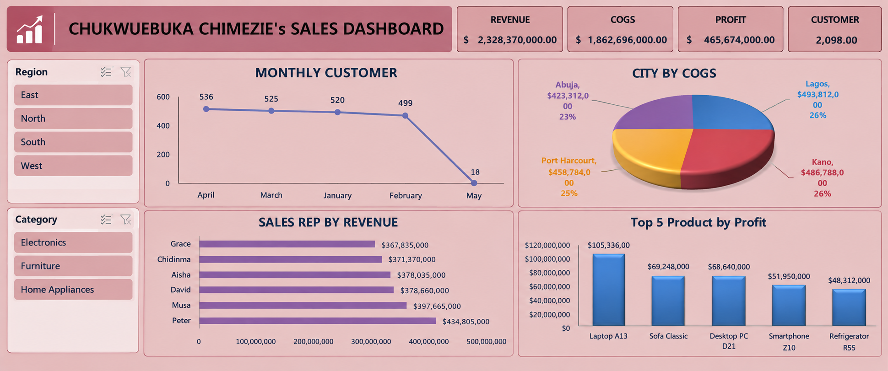

# Sales Performance Analysis Using Microsoft Excel

## Project Overview

This project presents an end-to-end sales performance analysis conducted using Microsoft Excel.

The analysis involved data cleaning, preparation, exploratory analysis, KPI development, PivotTables, PivotCharts, and the creation of an interactive sales performance dashboard.

The objective was to transform raw sales data into meaningful business insights that can support data-driven decision-making.

## Business Questions

The analysis was designed to answer the following business questions:

- What is the overall revenue generated?
- What is the total cost and profit?
- Which top 5 products generate the highest profit?
- Which sales representatives generate the highest revenue?
- Which cities have the highest costs?
- Which Month has the worst Performance?
- What are the KPIs?

## Tools & Skills

- Microsoft Excel
- Data Cleaning & Preparation
- Excel Tables
- PivotTables
- PivotCharts
- KPI Analysis
- Data Visualization
- Business Intelligence
- Business Insights

## Data Cleaning & Preparation

The dataset was cleaned and prepared in Microsoft Excel before analysis.

The preparation process included reviewing the dataset for data quality issues, organizing the data into a structured format, and preparing the dataset for PivotTable and visualization analysis.

## Key Performance Indicators

| KPI | Result |
|---|---:|
| Total Cost | $1,862,696,000 		
 |
| Total Revenue | $2,328,370,000 		
 |
| Total Profit |  $465,674,000 		
 |
| Total Customers | 2,098 |

## Dashboard

The final dashboard presents key sales performance metrics and visualizations developed using Excel PivotTables and PivotCharts.

## Key Analysis

The project analyzes sales performance across:

- Products
- Product Categories
- Regions
- Cities
- Sales Representatives
- Sales Channels
- Monthly Customer Activity

## Key Insights

The analysis provides insights into product profitability, sales representative performance, regional performance, city-level costs, and customer activity.

These findings can help management identify high-performing areas, monitor costs, improve sales strategies, and allocate resources more effectively.

## Business Recommendations

Based on the analysis, organizations can:

- Focus resources on high-performing products and sales representatives.
- Review underperforming products and regions.
- Monitor cost-intensive cities and operational areas.
- Identify opportunities to improve customer engagement.
- Use sales performance trends to support future planning and decision-making.

## Project Files

- `Sales_Performance_Analysis_Chukwuebuka_Chimezie.xlsx` — Excel workbook containing the analysis and dashboard.

## Author

**Chukwuebuka Chimezie**

Data Analyst | Microsoft Excel
